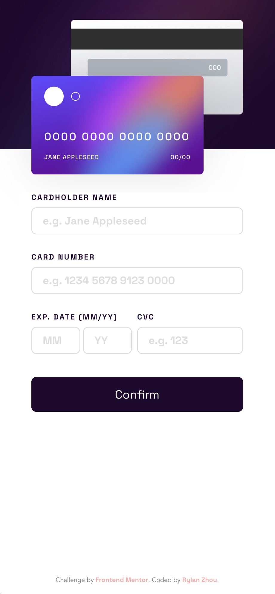

# Frontend Mentor - Interactive card details form solution

This is a solution to the [Interactive card details form challenge on Frontend Mentor](https://www.frontendmentor.io/challenges/interactive-card-details-form-XpS8cKZDWw). Frontend Mentor challenges help you improve your coding skills by building realistic projects.

## Table of contents

- [Overview](#overview)
  - [The challenge](#the-challenge)
  - [Screenshot](#screenshot)
  - [Links](#links)
- [My process](#my-process)
  - [Built with](#built-with)
  - [What I Implemented / Learned](#what-i-implemented-learned)

## Overview

This challenge is actually harder when trying to solve without using any frameworks but just vanilla javascript/typescript.

### The challenge

Users should be able to:

- [x] Fill in the form and see the card details update in real-time
- [x] Receive error messages when the form is submitted if:
  - [x] Any input field is empty
  - [x] The card number, expiry date, or CVC fields are in the wrong format
- [x] View the optimal layout depending on their device's screen size
- [x] See hover, active, and focus states for interactive elements on the page

> 📣 Also, error messages, if any, are dynamically prompted during input.

### Screenshot

|                 Desktop                 |                      Mobile                      |
| :-------------------------------------: | :----------------------------------------------: |
|  |  |

### Links

- Solution URL: [Github](https://github.com/RylanZhou/frontend-mentor-interactive-card-details-form)
- Live Site URL: [Vercel](https://frontend-mentor-interactive-card-details-form-nine.vercel.app/)

## My process

### Built with

- Semantic HTML5 markup
- CSS custom properties
- Flexbox
- Mobile-first workflow
- Typescript

### What I Implemented / Learned

**1. Use customized form validation**

First, disable origin form validation by adding `novalidate` attribute to the form element.

```html
<form novalidate>...</form>
```

In javascript, call `inputEl.checkValidity()` to see whether the value of `inputEl` is valid. All validity states can be checked by `inputEl.validity.<property_name>` according to what attributes are added to the input element.

```html
<input
  type="text"
  placeholder="e.g. 1234 5678 9123 0000"
  required
  pattern="\d{4} \d{4} \d{4} \d{4}"
  maxlength="19"
/>
```

For the input element above, possible validity properties to check are `valueMissing`, `patternMismatch`, `tooLong`.

**2. Hide arrows in input box where type="number"**

```scss
input {
  &::-webkit-outer-spin-button,
  &::-webkit-inner-spin-button {
    -webkit-appearance: none;
  }

  &[type='number'] {
    -moz-appearance: textfield;
  }
}
```

**3. Check user input before it goes to the input element**

Use `beforeinput` on input element and return `false` to prevent user input from getting applied.

Use `onkeypress` (⚠️ **DEPRECATED** ⚠️, use `onkeydown` instead) in javascript and return `false`.

**4. Use different error message on different inputs**

For better extensibility, I put error messages that are bond to specified input elements in `data-error` property, then just call `inputEl.dataset.error` to get these errors.

```javascript
if (input.validity.patternMismatch) {
  errorEl!.innerHTML = input.dataset.error || 'Pattern mismatch';
}
```

**5. Border with linear-gradient color**

There is actually no border. The trick is to apply linear-gradient on parent element, then put child element as `inset: 1px` to make it shrink 1px in all 4 directions to reveal part of the background.

**6. Make parent react to focus event on child elements**

Instead of manipulating classList in javascript, using css can also do the trick - `:focus-within`.

```scss
.wrapper {
  background: $light-gray;

  &:focus-within {
    background: $gradient;
  }
}
```
